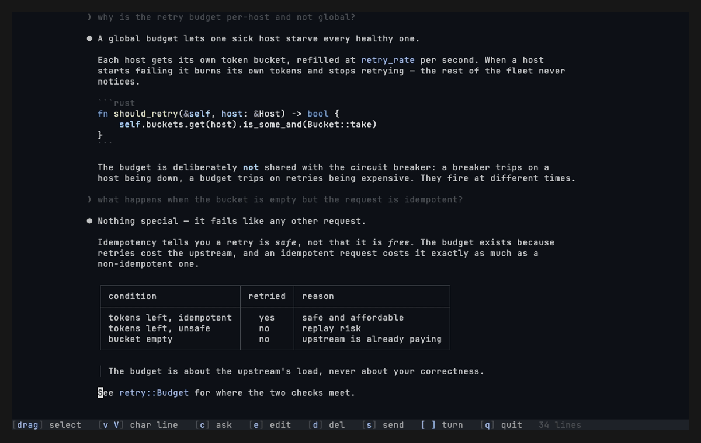

# herdr-quotr

[](https://github.com/napalmpapalam/herdr-quotr/actions/workflows/ci.yml)
[](LICENSE)

A [herdr](https://herdr.dev) plugin that quotes your agent's own answer back at it. One key
opens a full-screen picker over the focused Claude Code pane; you select what it said, attach
questions, and send the batch into its input box — unsubmitted.



It writes the format you'd type by hand:

```
"quoted line one
quoted line two"

the question

---
"another quote"

another question
```

The text comes from the session's transcript file, not from scraping the pane, so a quote is
the exact markdown the agent wrote — no box-drawing or soft-wrap artifacts, and a three-turn-old
answer costs one scroll instead of a scrollback hunt.

## Prerequisites

- **herdr ≥ 0.8.0** — [herdr.dev](https://herdr.dev)
- **Claude Code** — [claude.com/claude-code](https://claude.com/claude-code). The picker reads
  the session's transcript file; other agents don't have one.
- macOS or Linux.

## Installation

```bash
herdr plugin install napalmpapalam/herdr-quotr
```

That downloads the prebuilt binary for your platform — no Rust toolchain needed.

### From source

```bash
git clone https://github.com/napalmpapalam/herdr-quotr
cd herdr-quotr
cargo build --release
mkdir -p bin && install -m 0755 target/release/herdr-quotr bin/herdr-quotr
herdr plugin link .
```

`herdr plugin link` skips the download step, so rebuild and reinstall the binary after every
change — the popup runs it by absolute path and won't pick up a stale one.

### Verify

```bash
herdr plugin list
```

`napalmpapalam.quotr` should be listed and enabled.

### Bind a key

```toml
# ~/.config/herdr/config.toml
[[keys.command]]
key = "prefix+'"
type = "plugin_action"
command = "napalmpapalam.quotr.open"
description = "Quote agent answer"
```

```bash
herdr server reload-config
```

> [!IMPORTANT]
> A running herdr server doesn't re-read its config, so the binding does nothing until you
> reload. If the key still doesn't fire, `herdr plugin action invoke open --plugin
> napalmpapalam.quotr` tells a binding problem apart from a plugin problem.

If your terminal owns `Cmd`, give it the matching mapping. In Ghostty:

```
keybind = cmd+apostrophe=text:\x02'
```

## Usage

1. Focus a Claude Code pane and press your key. The picker opens on the newest line.
2. Drag over the lines you want. `[` and `]` jump between turns.
3. Press `c`, type a question, press Enter. That banks the pair.
4. Repeat for as many quotes as you like.
5. Press `s`. Everything lands in the agent's input box. Press Enter yourself.

The picker never submits, and it closes as soon as the text is delivered.

## Controls

The mouse is the primary input; the keyboard is a full fallback.

| key | does |
| --- | --- |
| drag | select the characters you cross |
| wheel | scroll one line |
| click | place the caret |
| `h` `j` `k` `l` / arrows | move by character and line |
| `g` / `G` | first / last line |
| `PgUp` / `PgDn` | page |
| `[` / `]` | previous / next turn |
| `v` / `V` | select by character / by whole line |
| `esc` | clear the selection |
| `c` | ask a question about the selection |
| `e` | reopen the question of the pair under the caret |
| `d` | drop the pair under the caret |
| `s` | bank the live selection, then send the batch |
| `q` | quit |

In the question box: Enter banks, Esc goes back, Ctrl+U clears.

Mouse capture is on while the picker is up, so the terminal's own text selection — and copying
out of the popup — is unavailable there.

## Configuration

`config.toml` in the plugin's config dir; `herdr plugin config-dir napalmpapalam.quotr` prints
the path. Both keys are optional, and unknown keys are ignored.

```toml
theme = "vs-dark-plus"
measure = 100
```

| key | default | purpose |
| --- | --- | --- |
| `theme` | `vs-dark-plus` | palette and syntax colors, set together |
| `measure` | `100` | width cap for the centered text column, in columns (20–400) |

A file that fails to parse, or a value quotr can't honor, shows up in the picker's status line
and the picker runs on the defaults. The config is read once at startup.

**Themes** — names match herdr's own, so a value copied from a herdr config resolves the same
in both: `vs-dark-plus`, `catppuccin`, `catppuccin-latte`, `catppuccin-frappe`,
`catppuccin-macchiato`, `dracula`, `nord`, `gruvbox`, `gruvbox-light`, `one-dark`, `one-light`,
`solarized`, `solarized-light`, `github-light`, `monokai`, `tokyo-night`, `tokyo-night-day`,
`rose-pine`, `rose-pine-dawn`. Run `cargo run --example themes` from a checkout to see them all.

Placement isn't configurable: herdr accepts a popup placement only from a plugin's manifest,
never from the CLI, so changing it means editing `herdr-plugin.toml`.

## Known limits

- **The question is one line** — Enter banks the pair.
- **Pairs send in bank order**, not in the order they appear in the transcript.
- **Thinking blocks aren't shown.**
- **A permission prompt swallows sent text** while the send still reports success. When the
  agent is `blocked`, quotr parks the whole batch and restores it the next time you open the
  picker, rather than losing it silently.

## Contributing

Issues and pull requests are welcome. `CLAUDE.md` covers the architecture and the invariants
worth knowing before editing; CI runs `cargo fmt`, `clippy`, `test`, `doc`, and `shellcheck`.

Built after [reviewr](https://github.com/persiyanov/herdr-reviewr), which put a code-review
pane next to the chat — quotr borrows its theme catalog, its comment-bank ergonomics, and its
insert-never-submit send path for a different job.

## License

[MIT](LICENSE). Syntax highlighting comes from [syntect](https://github.com/trishume/syntect)
and [two-face](https://github.com/CosmicHorrorDev/two-face). The `.tmTheme` files in `assets/`
carry their own licenses: Visual Studio Dark+ by vidann1 (a port of
[VS Code](https://github.com/microsoft/vscode) Dark+, MIT),
[Catppuccin Mocha](https://github.com/catppuccin/bat) (MIT),
[Tokyo Night](https://github.com/folke/tokyonight.nvim) (Apache-2.0), and
[Rosé Pine](https://github.com/rose-pine/tm-theme) (MIT).
